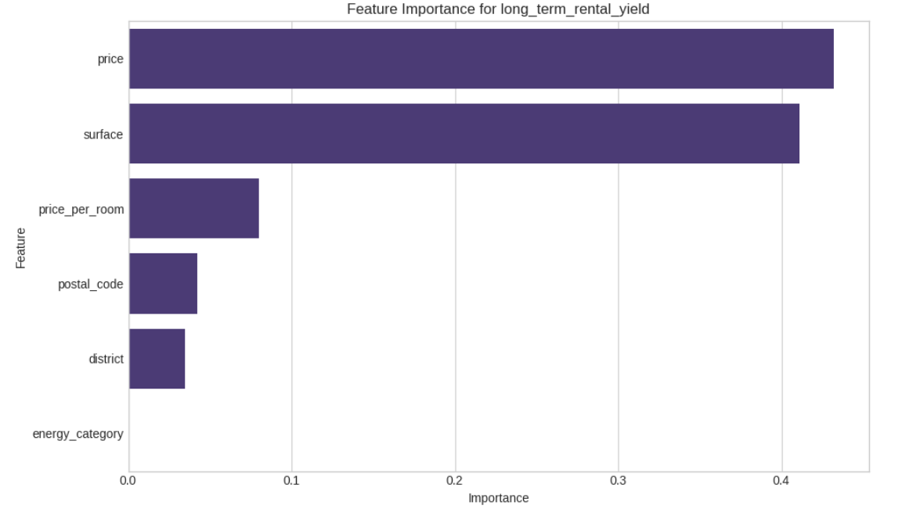
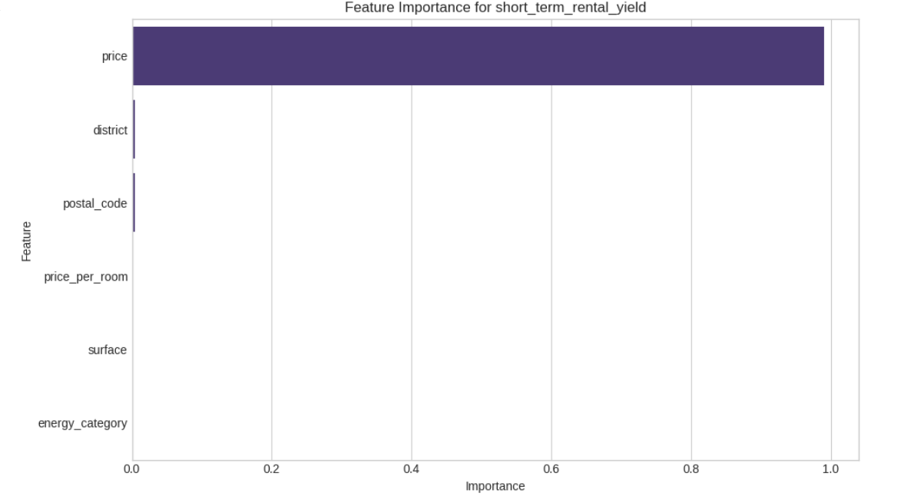
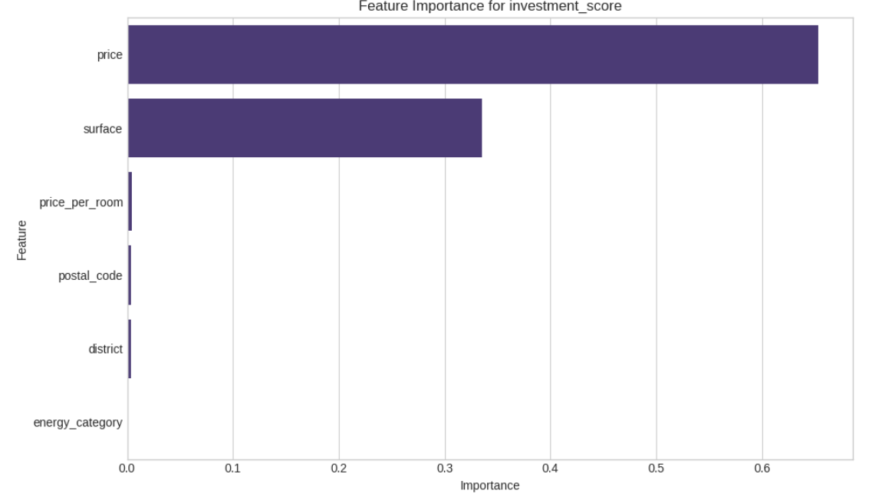
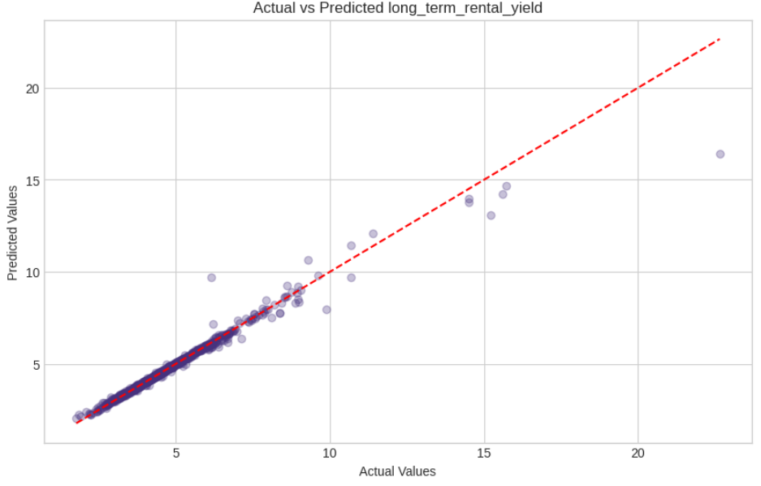
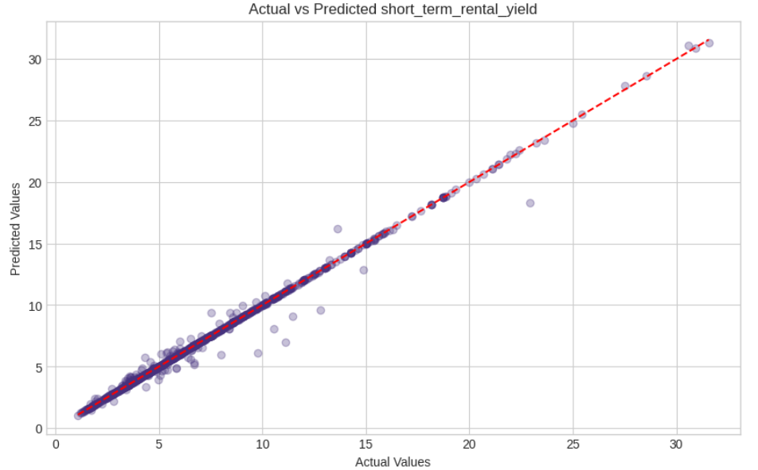
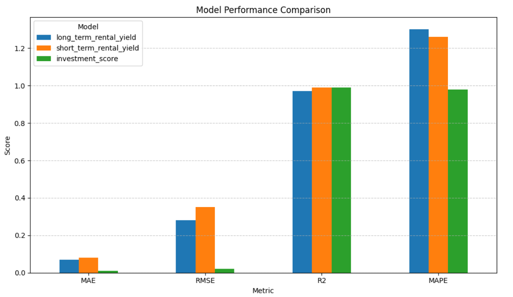

# Real Estate Rental Yield Prediction

This repository contains all code and data needed to reproduce the Real Estate Rental Yield Prediction Analysis (V2). We use a Random Forest Regressor to predict three key target variables:

1. **Long-Term Rental Yield**  
2. **Short-Term (Airbnb) Rental Yield**  
3. **Overall Investment Score**  

---

## 📋 Project Overview

Many investors need quick insights into how well a property will perform—both as a traditional long-term rental and as an Airbnb (short-term rental). The goal here is to build a model that, given a property’s features, estimates:

- Annualized long-term rental yield (%).  
- Expected short-term (Airbnb) rental yield (%).  
- A composite investment score that combines various indicators.  

To achieve this, we combine data from multiple sources (apartments, property listings, Airbnb), clean and engineer features, and train a Random Forest Regressor for each target variable.

---

## 🗂️ Data Sources

1. **AD08FR31096_seloger_apartments_flattened.csv**  
   - Apartments for sale in Paris, with columns like `price`, `surface`, `postal_code`, etc.

2. **AD08FR31096_seloger_properties_flattenedbatch1.csv**  
   - Properties for sale with detailed information.

3. **AD08FR31096_seloger_properties_flattenedbatch2.csv**  
   - Properties for rent with detailed information.

4. **AD08FR31096_seloger_properties_flattenedbatch3.csv**  
   - Additional properties for sale with detailed information.

5. **InsideAirbnb Paris Data**  
   - Short-term rental data for Paris from InsideAirbnb.

---

## 🧹 Data Cleaning & Feature Engineering

1. **Basic Cleaning**  
   - Remove rows with missing or invalid `price` or `surface`.
   - Remove outliers in `price`, `surface`, and `price_per_sqm` (outside 1st–99th percentiles).
   - Standardize column names and data types.

2. **Yield Calculations**  
   - **Long-Term Yield** = `(estimated_annual_rent / price) × 100`
   - **Short-Term Yield** = `(estimated_annual_airbnb_income / price) × 100`
   - Rental yields are calculated by merging sale and rental datasets on `postal_code` and using median or average values.

3. **Feature Engineering**  
   - `district` extracted from `postal_code`.
   - `price_per_room` calculated if room count is available.
   - Property type and condition flags (e.g., `is_apartment`, `is_renovated`), amenity flags (e.g., `has_balcony`, `has_parking`), and energy efficiency category (`energy_category`).
   - `price_to_rent_ratio` and a composite `investment_score` (combining normalized yields and property features).

4. **Final Aggregation**  
   - Concatenate cleaned and feature-engineered DataFrames from apartments and property batches.
   - Remove duplicates based on `price`, `surface`, and `postal_code`.
   - Construct final feature matrix **X** and target dict **y_dict** for the three targets.

---

## 🔄 Train/Test Split

- Each target variable is split into 80% training and 20% testing sets using `train_test_split(random_state=42)`.
- This yields three separate train/test splits, one for each target.

---

## 🌲 Modeling: Random Forest Regressor

A scikit-learn pipeline is used for each target:

```python
from sklearn.pipeline import Pipeline
from sklearn.compose import ColumnTransformer
from sklearn.impute import SimpleImputer
from sklearn.preprocessing import StandardScaler, OneHotEncoder
from sklearn.ensemble import RandomForestRegressor

numeric_features = [list_of_numeric_cols]
categorical_features = [list_of_categorical_cols]
boolean_features = [list_of_boolean_cols]

numeric_transformer = Pipeline([
    ("imputer", SimpleImputer(strategy="mean")),
    ("scaler", StandardScaler()),
])

categorical_transformer = Pipeline([
    ("imputer", SimpleImputer(strategy="most_frequent")),
    ("onehot", OneHotEncoder(handle_unknown="ignore", sparse=False)),
])

preprocessor = ColumnTransformer([
    ("num", numeric_transformer, numeric_features),
    ("cat", categorical_transformer, categorical_features),
    ("bool", "passthrough", boolean_features),
])

model_pipeline = Pipeline([
    ("preprocessor", preprocessor),
    ("regressor", RandomForestRegressor(n_estimators=100, random_state=42)),
])

# For each target:
model_pipeline.fit(X_train, y_train)
y_pred = model_pipeline.predict(X_test)
```

All three targets use the same pipeline structure, but are trained independently.

---

## 📊 Evaluation Metrics

For each target:

* **MAE (Mean Absolute Error)**
* **RMSE (Root Mean Squared Error)**
* **R² (Coefficient of Determination)**
* **MAPE (Mean Absolute Percentage Error)**

| Target                     |  MAE | RMSE |   R² | MAPE (%) |
| :------------------------- | ---: | ---: | ---: | -------: |
| long_term_rental_yield     | 0.07 | 0.28 | 0.97 |    1.30  |
| short_term_rental_yield    | 0.08 | 0.35 | 0.99 |    1.26  |
| investment_score           | 0.01 | 0.02 | 0.99 |    0.98  |

---

## 💡 Key Insights

1. **Feature Importance (Long-Term Yield):**
   - `price`, `surface`, and `price_per_room` are most predictive.
2. **Feature Importance (Short-Term Yield):**
   - `price`, `district`, and `postal_code` are most predictive.
3. **Investment Score:**
   - Driven by `price`, `surface`, and yield-related features.
4. **Model Performance:**
   - Random Forest achieves R² in the range 0.97–0.99, with low MAE and RMSE.

---

## 🖼️ Visualizations

### 1. Long-Term Yield: Feature Importance



### 2. Short-Term Yield: Feature Importance



### 3. Investment Score: Feature Importance



### 4. Predicted vs. Actual (Long-Term Yield)



### 5. Predicted vs. Actual (Short-Term Yield)



### 6. Model Evaluation


---

## 🏃 How to Reproduce

1. **Clone this repo**

   ```bash
   git clone https://github.com/RidaHajjAli/Real-Estate-Yield-Analysis.git
   cd Real-Estate-Yield-Analysis
   ```

2. **Set up a virtual environment**

   ```bash
   python3 -m venv venv
   source venv/bin/activate      # macOS/Linux
   venv\Scripts\activate         # Windows
   pip install -r requirements.txt
   ```

   * The `requirements.txt` file should contain at least:

   ```
   pandas
   numpy
   matplotlib
   seaborn
   scikit-learn
   jupyter
   ```

3. **Open and run the notebook**

   ```bash
   jupyter notebook Real_Estate_Yield_Analysis.ipynb
   ```

   – Ensure all data files are in the correct folder.

4. **Export Figures**
   – Save plots as PNGs and commit them to the `images/` directory.

5. **Review Results & Visuals**
   – Check the printed evaluation metrics and visualizations in the notebook.

---

## ⚙️ Folder Structure

```
real_estate_yield_prediction/
│
├── data/
│   ├── AD08FR31096_seloger_apartments_flattened.csv
│   ├── AD08FR31096_seloger_properties_flattenedbatch1.csv
│   ├── AD08FR31096_seloger_properties_flattenedbatch2.csv
│   ├── AD08FR31096_seloger_properties_flattenedbatch3.csv
│   └── airbnb_listings.csv
│
├── images/
│   ├── feature_importance_long_term.png
│   ├── feature_importance_short_term.png
│   ├── feature_importance_investment_score.png
│   ├── pred_vs_actual_long_term.png
│   └── pred_vs_actual_short_term.png
│
├── Real_Estate_Yield_Analysis.ipynb
├── README.md
├── requirements.txt
```

---

## 🔮 Future Improvements

* Hyperparameter tuning (e.g., `GridSearchCV` for Random Forest).
* Try alternative models (e.g., Gradient Boosting, XGBoost).
* Geospatial analysis for yield heatmaps.
* Web app deployment (Streamlit/Flask).
* Time-series modeling if historical data is available.

---

## 📄 License

This project is released under the MIT License. Feel free to copy, modify, and distribute.

---
